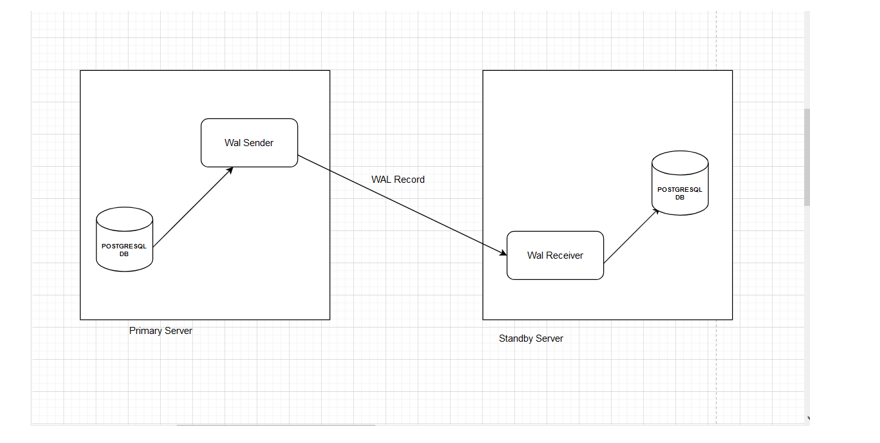

# PostgreSQL-Streaming-Replication-Setup-Primary-DR



   

This guide outlines a step-by-step process to configure PostgreSQL Streaming Replication between a primary server (testserver1) and a standby server (testserver2) which acts as a Disaster Recovery (DR) node.
🧩 Prerequisites

    PostgreSQL installed on both servers (version 14 assumed)

    Network connectivity between primary and standby

    Replication user and access configured

    Windows environment (paths reflect this; adjust for Linux)

🖥️ Step 1: Configure Primary Server (testserver1)
🔧 Edit postgresql.conf

Update the following parameters:
```
listen_addresses = '*'
wal_level = replica
max_wal_senders = 5
wal_keep_segments = 32
hot_standby = on
```
Explanation:

    listen_addresses = '*': Accept connections from any IP

    wal_level = replica: Enables WAL generation for replication

    max_wal_senders = 5: Number of allowed concurrent WAL senders

    wal_keep_segments = 32: Number of WAL segments retained

    hot_standby = on: Allows read-only queries on standby

🔐 Edit pg_hba.conf

Add the following line to allow replication access from the standby:
```
host    replication     replicator      52.187.165.22/32     md5
```
    Replace 52.187.165.22 with the actual IP of testserver2.

👤 Create Replication User
```
CREATE USER replicator WITH REPLICATION PASSWORD 'replicator_password';
```
🔁 Restart PostgreSQL

Restart the PostgreSQL service to apply the changes.
🖥️ Step 2: Prepare Standby Server (testserver2)
⛔ Stop PostgreSQL Service

Stop the PostgreSQL service on the standby server.
🧹 Clear Data Directory

Navigate to your data directory and delete all contents:
```
C:\Program Files\PostgreSQL\14\data
```
📦 Step 3: Take Base Backup from Primary

Use pg_basebackup to copy the data from primary:
```
pg_basebackup -h 13.67.60.129 -D "C:\Program Files\PostgreSQL\14\data" -U replicator -P -v -R -X stream -C -S pgstandby1
```
Options:
```
    -h 13.67.60.129: IP of testserver1

    -D: Target data directory

    -U: Replication user

    -R: Creates standby.signal automatically

    -X stream: Stream WAL during backup

    -C -S pgstandby1: Create and use replication slot pgstandby1
```
You should see:

pg_basebackup: base backup completed

⚙️ Step 4: Configure Standby Server
🔧 Edit postgresql.conf

Add the following lines to the config:
```
primary_conninfo = 'user=replicator password=replicator_password host=13.67.60.129 port=5432 sslmode=prefer'
primary_slot_name = 'pgstandby1'
```
🔁 Restart PostgreSQL

Restart the PostgreSQL service to start streaming replication.
✅ Step 5: Verify Replication
📌 On Primary (testserver1)

Run:
```
psql -U postgres -c "SELECT * FROM pg_stat_replication;"
```
Look for:

    client_addr: IP of standby

    state: Should show streaming

Example Output:
```
pid  | usename   | client_addr  | state     | sent_lsn | write_lsn | flush_lsn | replay_lsn
-----+-----------+--------------+-----------+----------+-----------+-----------+------------
7920 | replicator| 52.187.165.22| streaming | 0/5000060| 0/5000060 | 0/5000060 | 0/5000060
```
📌 On Standby (testserver2)

Run:
```
psql -U postgres -c "SELECT * FROM pg_stat_wal_receiver;"
```
This confirms WAL receiver is active and connected.
📎 Notes

    Ensure firewalls and PostgreSQL port (default: 5432) are open

    For production, secure pg_hba.conf and consider using SSL

    Monitor replication lag using pg_stat_replication regularly
